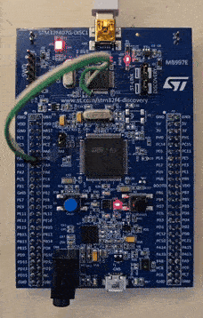

# STM32F4 CMSIS LED Blinky Using SysTick

[](LICENSE)

This project demonstrates LED blinking using the **SysTick timer** for millisecond delay, with a **Board Support Package (BSP)** abstraction for the LEDs and the button on the **STM32F407G-DISC1** board. This is a **bare-metal CMSIS project** (no HAL or LL is used).

---
## Features

- **CMSIS-only bare-metal implementation** (no HAL, no LL)
- **168MHz system clock** (configured with HSE + PLL)
- **SysTick-based timing functions** for delays and timekeeping
- **BSP abstraction** for LEDs and Button:
  - `BSP_LED_Init()`, `BSP_LED_On()`, `BSP_LED_Off()`, `BSP_LED_Toggle()`
  - `BSP_Button_Init()`, `BSP_Button_Read()`
- **Doxygen-documented code** for easy navigation and understanding

---
## Project Structure

```bash
01-LED_Blinky_SysTick/
│── Core/
│   ├── Inc/           # Header files
│   │   ├── system.h                # System initialization (clock, debug, NVIC)
│   │   ├── system_stm32f4xx.h      # CMSIS Cortex-M4 Device System Header File for STM32F4xx devices
│   │   └── systick.h               # SysTick timer interface
│   ├── Src/           # Source files
│   │   ├── main.c                  # Application entry point
│   │   ├── system.c                # System configuration and clock setup
│   │   ├── system_stm32f4xx.c      # CMSIS Cortex-M4 Device Peripheral Access Layer System Source File
│   │   └── systick.c               # SysTick implementation
│   └── Startup/
│       └── startup_stm32f407vgtx.s # Startup assembly file    
├── Drivers/
│   ├── BSP/           # BSP files
│   │   ├── bsp.c                   # BSP implementation
│   │   ├── bsp.h                   # BSP interface
│   │   ├── bsp_button.c            # BSP button functions
│   │   ├── bsp_button.h            # BSP button interface
│   │   ├── bsp_led.c               # BSP LED functions
│   │   └── bsp_led.h               # BSP LED interface
│   └── CMSIS          # CMSIS files
├── assets/
│   └── demo.gif
├── Doxyfile                  # Doxygen config
├── LICENSE.txt               # MIT License
├── README.md                 # Project details
├── STM32F407VGTX_FLASH.ld    # Linker script for STM32F407VGTx Device from STM32F4 series
└── STM32F407VGTX_RAM.ld      # Linker script for STM32F407VGTx Device from STM32F4 series
```
---
## How It Works

1. **System_Init()**
   Configures NVIC, enables SWD debug, and sets system clock to **168MHz**.

2. **BSP_Init()**
   Initializes LEDs and Button GPIOs.

3. **SysTick_Init()**
   Configures SysTick for a **1ms interrupt**. Provides:
     - `millis()`: elapsed time since startup
     - `SysTick_delay_ms(ms)`: blocking delay
  
4. **Main loop**
   toggles the **red LED** every 1000 ms

---
## Building and Flashing
**Prerequisites**
  - **STM32F407G-DISC1** development board
  - **ARM GCC Toolchain** or **STM32CubeIDE**
  - **ST-Link** programmer/debugger
  - *Doxygen* (optional, for generating docs)

**Getting Started**
1. Clone the repository:
```bash
git clone https://github.com/parham-estiri/STM32F4-CMSIS-Projects.git
```
2. Open the project in **STM32CubeIDE** or you preferred ARM toolchain (Keil, IAR, etc.)
3. Build and flash to your STM32F407G-DISC1 board
4. Observe the LED behavior
---
## Demo
- Here's the LED blinking in action:

- 
- On reset:
  - The **red LED (LD5)** toggles every **1 second**.
  - Button drivers are initialized (for future use).

- **Note**: The wires from ST-Link to PA2 and PA3 are not used in this project.

---
## Doxygen Documentation
- The project is fully documented using **Doxygen**. Follow these steps to generate and view the documentation:
1. **Install Doxygen**
    - Windows: [https://www.doxygen.nl/download.html](https://www.doxygen.nl/download.html)
    - Linux (Ubuntu/Debian):
    ```bash
    sudo apt install doxygen
    ```

2. **Generate Documentation**
    - From the project root directory (where `Doxyfile` is located), run:
    ```bash
    doxygen Doxyfile
    ```
    This will generate HTML files in `docs/html/`.

3. **View Documentation**
    - Open `docs/html/index.html` in a web browser. You can browse:
      - Modules
      - Functions
      - Detailed comments and explanations

---
## License
This project is licensed under the MIT License.
Feel free to use it in your own embedded projects.

---
## Author
**Parham Estiri**
Embedded Systems Developer